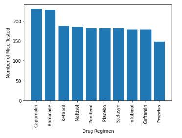
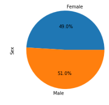
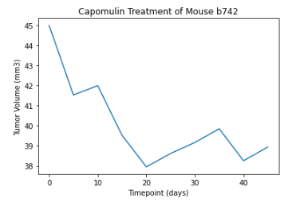

# matplotlib-challenge

## Overview

In this repository, the user analyzed data from a pharmaceutical company, Pymaceuticals, Inc., that specializes in anti-cancer medications related to squamous cell carcinoma. The data focused on possible treatment regimens.  

## Analysis

Matplotlib as well as Jupyter Notebook and Pandas were used in this analysis to uncover trends related to the number of mice tested per drug regimen, gender percent of mice tested, tumor volume, and more. The results of this data can be seen within various data visualization tools, including pie charts, line graphs, bar charts, scatter plots, and box plots. Ultimately, the tools used were useful in determining the trends and correlation of various variables within the Pymaceutical data set by using mulitple tables and figures. 

## Results
### Drug Regimen vs. # of Mice Tested

  

### Gender Percentage

### Tumor Volume vs. Timepoint of Mouse b742
  

