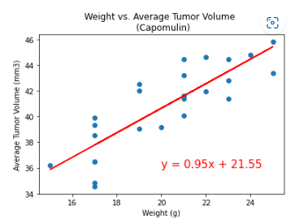

# matplotlib-challenge

## Overview

In this repository, the user analyzed data from a pharmaceutical company, Pymaceuticals, Inc., that specializes in anti-cancer medications related to squamous cell carcinoma. The data focused on possible treatment regimens.  

## Analysis

Matplotlib as well as Jupyter Notebook and Pandas were used in this analysis to uncover trends related to the number of mice tested per drug regimen, gender percent of mice tested, tumor volume, and more. The results of this data can be seen within various data visualization tools, including pie charts, line graphs, bar charts, scatter plots, and box plots. Ultimately, the tools used were useful in determining the trends and correlation of various variables within the Pymaceutical data set by using mulitple tables and figures. 

## Observations & Inferences

1. The average tumor volume of a mouse treated with Capomulin was directly related to the mouse's weight in grams. Referencing the line of regression, these variables have a strong, positive, correlatation as the correlation coefficient results at 0.84. Overall, this data suggests that the greater the tumor volume of a mouse treated with Capomulin, the greater the mouse weighs.

2. The distribution of tumor volume for Capomulin, Ramicane, Infubinol, and Ceftamin can be visualized in the boxplot below. This data shows that Infubinol and Ceftamin have siginificantly greater final tumor volume values than Capomulin and Ramicane as represented by their quartile distributions. It can be inferred that both Capomulin and Ramicane outperform Infubinol and Ceftamin in regards to decreasing tumor volume. 

3. Within this dataset, the tumor volume to timepoint was depicted in a line graph for mouse b742 tested with Capomulin. The correlation coefficient between these two variables resulted at -0.75, a strong negative correlation. Although this particular data depicts a strong correlation value it cannot be inferred that all mice tested with Capomulin have a strong negative correlation between tumor volume and timepoint in days. More samples need to be tested. 

## Results
### Drug Regimen vs. # of Mice Tested

  

### Gender Percentage

### Tumor Volume vs. Timepoint of Mouse b742
  

### Correlation between mouse weight and average tumor volume (Capomulin)

